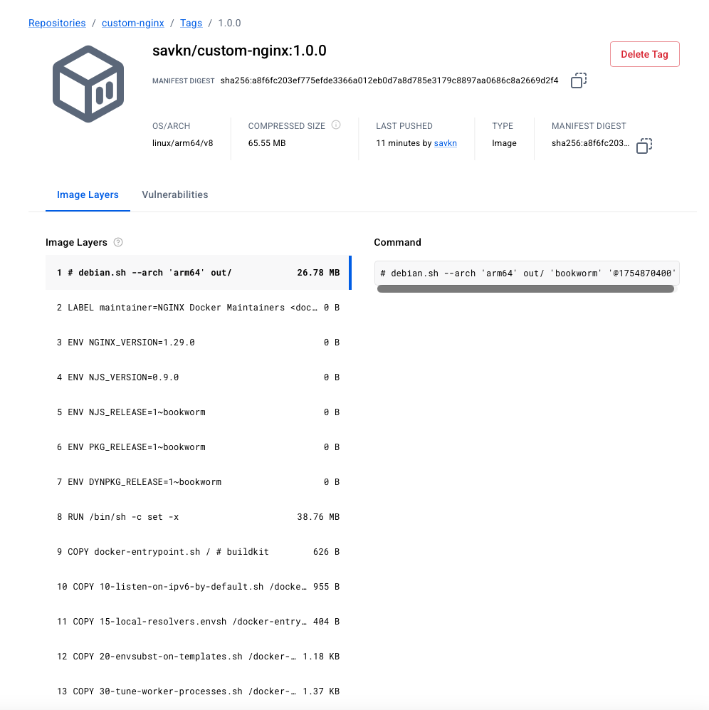

# Домашнее задание к занятию 4 «Оркестрация группой Docker контейнеров на примере Docker Compose»

## Задача 1

- Создан публичный репозиторий: savkn/custom-nginx
- Ссылка на репозиторий: [custom-nginx](https://hub.docker.com/repository/docker/savkn/custom-nginx/general)

(Тег 1.0.0 успешно запушен, образ основан на nginx:1.29.0 с заменённым index.html)

