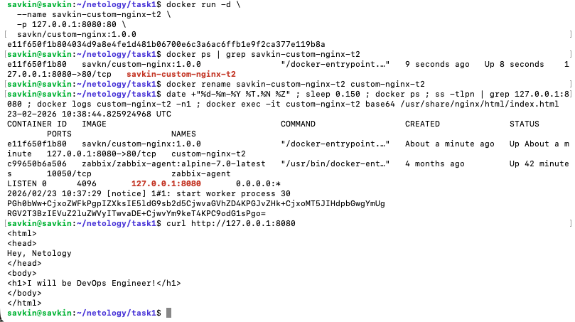
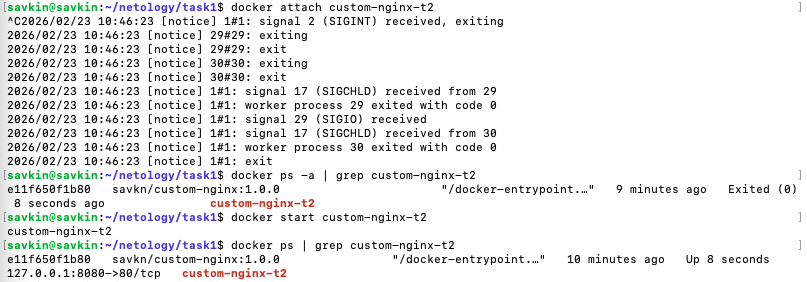
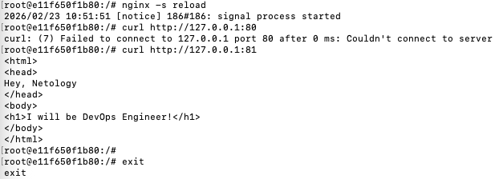
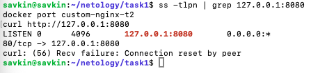
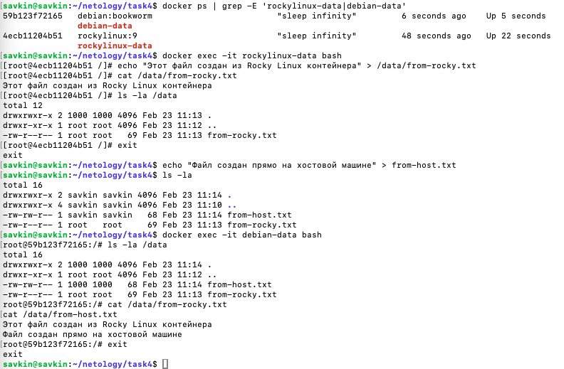
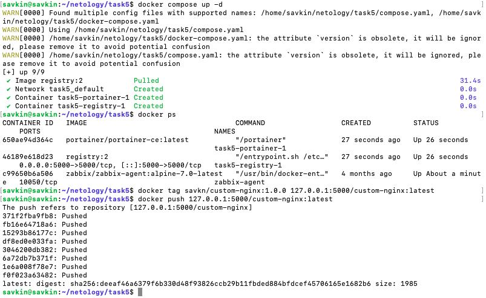
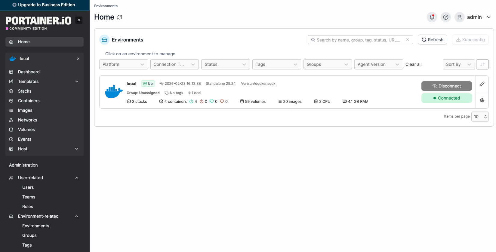
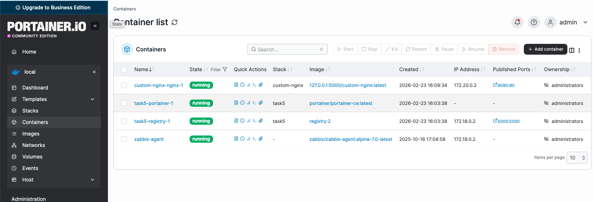
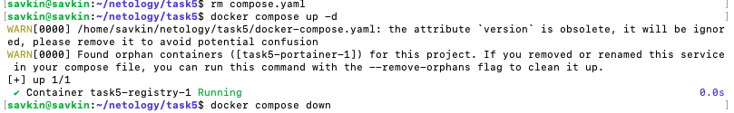

# Домашнее задание к занятию 4 «Оркестрация группой Docker контейнеров на примере Docker Compose»

## Задача 1

- Создан публичный репозиторий: savkn/custom-nginx
- Ссылка на репозиторий: [custom-nginx](https://hub.docker.com/repository/docker/savkn/custom-nginx/general)

(Тег 1.0.0 успешно запушен, образ основан на nginx:1.29.0 с заменённым index.html)

## Задача 2

- Запуск, переименование и проверка контейнера

## Задача 3

### Подключение к потокам, остановка, изменение конфига и проблема с портом

#### Объяснение:
`docker attach` подключается к `PID 1` контейнера (nginx в foreground-режиме). Ctrl+C отправляет `SIGINT` главному процессу → nginx завершает работу → контейнер останавливается

#### Объяснение:
Маппинг портов (`-p 127.0.0.1:8080:80`), заданный при запуске контейнера, фиксирован и перенаправляет трафик с хоста строго на внутренний порт `80`.
После редактирования конфигурации и `nginx -s reload` сервер стал слушать только порт `81`.
`Docker` не меняет маппинг динамически → входящие соединения на внутренний порт 80 попадают в никуда → соединение сбрасывается (`Connection reset by peer`)

## Задача 4
### Демонстрация общих томов между контейнерами

#### Вывод:
Оба файла видны и читаемы из второго контейнера → том (-v) монтирует одну и ту же директорию хоста в /data обоих контейнеров. Изменения синхронизируются мгновенно (между хостом и всеми подключёнными контейнерами)

## Задача 5

### Работа с Docker Compose, include, локальный registry и Portainer

#### Суть предупреждения:
Compose обнаружил "сиротский" контейнер task5-portainer-1 (от предыдущих запусков с compose.yaml).
После удаления compose.yaml остался только docker-compose.yaml → запустился только registry
[compose.yaml](compose.yaml)
[docker-compose.yaml](docker-compose.yaml)

